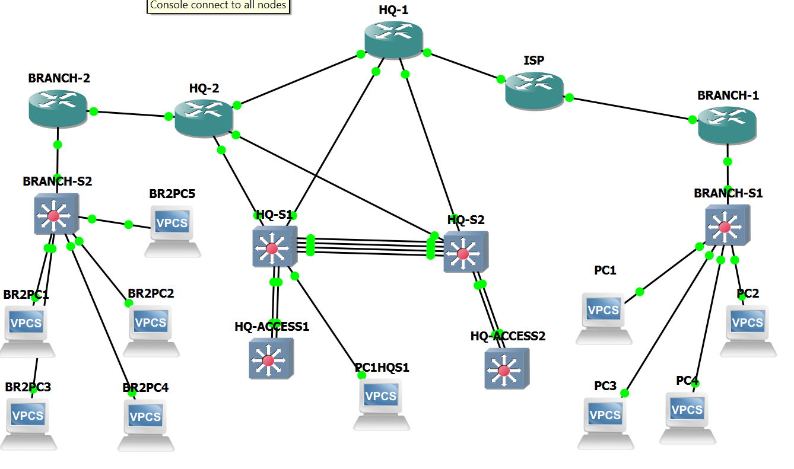

# Enterprise GNS3 Network Engineering Portfolio

A multi-site enterprise network designed, configured, troubleshot, and validated in **GNS3 using Cisco IOS**.

This project demonstrates practical enterprise networking skills across routing, switching, high availability, Layer 2 security, WAN connectivity, and network troubleshooting.

---

## 📌 Project Overview

The network simulates an enterprise environment consisting of:

- Headquarters (HQ)
- Branch 1
- Branch 2
- ISP/WAN connectivity
- Redundant HQ routers
- Redundant HQ switching
- Access-layer switches
- Multiple VLANs
- End-user and server networks

The project was built as a hands-on network engineering lab rather than a simple configuration exercise. The network was configured, tested, intentionally subjected to failure scenarios, troubleshot, and validated for end-to-end connectivity.

---

## 🌐 Network Topology

The following topology represents the completed multi-site enterprise network built and tested in GNS3.



---

## 🛠 Technologies Implemented

### Routing

- IPv4 addressing
- VLSM subnetting
- OSPF
- Static routing
- Default routing
- Static route redistribution into OSPF
- Passive OSPF interfaces
- Router-on-a-Stick
- Inter-VLAN routing
- WAN routing

### Switching

- VLANs
- IEEE 802.1Q trunking
- PVST
- STP root bridge tuning
- LACP EtherChannel
- Access and trunk ports
- PortFast

### High Availability

- HSRP Version 2
- Active/Standby gateway redundancy
- HSRP priority configuration
- Preemption
- Gateway failover testing

### Layer 2 Security

- Port Security
- DHCP Snooping
- Dynamic ARP Inspection (DAI)
- BPDU Guard
- Root Guard
- Loop Guard

---

## 🏢 VLAN Design

| VLAN | Purpose |
|---:|---|
| 10 | Users |
| 20 | Servers |
| 30 | Voice |
| 40 | Guest |
| 99 | Management |

VLAN 99 is used as the management VLAN where required.

---

## 📡 Network Devices

### Routers

| Portfolio Name | Role |
|---|---|
| HQ-R1 | Primary HQ router |
| HQ-R2 | Secondary HQ router |
| ISP-R1 | Simulated ISP router |
| BRANCH-R1 | Branch 1 router |
| BRANCH-R2 | Branch 2 router |

### Switches

| Device | Role |
|---|---|
| HQ-SW1 | HQ distribution switch |
| HQ-SW2 | HQ distribution switch |
| HQ-ACCESS1 | HQ access switch |
| HQ-ACCESS2 | HQ access switch |
| BRANCH-S1 | Branch 1 access switch |
| BRANCH-S2 | Branch 2 access switch |

---

## 🔢 IP Addressing Design

### Headquarters

| VLAN | Network | Purpose |
|---:|---|---|
| 10 | 10.10.0.0/25 | Users |
| 20 | 10.10.0.128/26 | Servers |
| 30 | 10.10.0.192/26 | Voice |
| 40 | 10.10.1.0/27 | Guest |
| 99 | 10.10.1.32/27 | Management |

### Branch 1

| VLAN | Network |
|---:|---|
| 10 | 10.20.0.0/26 |
| 20 | 10.20.0.64/27 |
| 30 | 10.20.0.96/27 |
| 40 | 10.20.0.128/28 |

### Branch 2

| VLAN | Network |
|---:|---|
| 10 | 10.30.0.0/27 |
| 20 | 10.30.0.32/28 |
| 30 | 10.30.0.48/28 |
| 40 | 10.30.0.64/29 |
| 99 | 10.30.0.72/29 |

### WAN Links

| Network | Connection |
|---|---|
| 10.255.0.0/30 | HQ-R1 ↔ HQ-R2 |
| 10.255.0.4/30 | HQ-R1 ↔ ISP-R1 |
| 10.255.0.8/30 | HQ-R2 ↔ BRANCH-R2 |
| 10.255.0.12/30 | ISP-R1 ↔ BRANCH-R1 |

---

## 🔄 OSPF Design

OSPF process **1** is used for dynamic routing within the enterprise network.

| Router | Router ID |
|---|---|
| HQ-R1 | 1.1.1.1 |
| HQ-R2 | 2.2.2.2 |
| BRANCH-R1 | 3.3.3.3 |
| BRANCH-R2 | 4.4.4.4 |

HQ-R1 and HQ-R2 form an OSPF adjacency over the HQ inter-router link.

BRANCH-R2 forms an OSPF adjacency with HQ-R2.

The simulated ISP router does **not** participate in OSPF and instead uses static routes.

HQ-R1 redistributes required static routes into OSPF and originates a default route for the OSPF domain.

---

## ♻️ HSRP Gateway Redundancy

HQ-R1 and HQ-R2 provide redundant default gateways for the HQ VLANs using **HSRP Version 2**.

HSRP is configured for:

- VLAN 10
- VLAN 20
- VLAN 30
- VLAN 40
- VLAN 99

HQ-R1 uses a higher HSRP priority and preemption, making it the preferred Active router during normal operation.

Failover was tested by disabling the active HQ LAN interface. HQ-R2 successfully assumed the Active role, and HQ-R1 returned to Active after restoration because preemption was configured.

---

## 🔗 EtherChannel and Switching Redundancy

The HQ switching environment uses **LACP EtherChannel** for link aggregation and redundancy.

A four-link EtherChannel connects the two HQ distribution switches.

Additional EtherChannels connect the distribution layer to the HQ access switches.

This design provides:

- Increased link capacity
- Link redundancy
- Logical interface aggregation
- Protection against individual member-link failure

---

## 🌳 Spanning Tree Design

PVST is used in the HQ switching environment.

Root bridge priorities were tuned so the two HQ switches can provide different preferred spanning-tree roles across VLANs.

Additional STP protection mechanisms include:

- PortFast
- BPDU Guard
- Root Guard
- Loop Guard

---

## 🔐 Layer 2 Security

Multiple Layer 2 security mechanisms were implemented and tested.

### DHCP Snooping

DHCP Snooping is enabled for VLAN 10 on the HQ switching infrastructure.

### Dynamic ARP Inspection

Dynamic ARP Inspection is enabled for VLAN 10.

Router-facing trunk interfaces were configured as trusted DAI interfaces after troubleshooting ARP inspection behavior.

### Port Security

Port Security was configured on an HQ access-facing port with violation restriction.

### STP Protection

The project also demonstrates:

- BPDU Guard
- Root Guard
- Loop Guard

---

## 🔧 Troubleshooting Experience

Troubleshooting was an important part of this project.

Issues investigated and resolved included:

- Incorrect WAN interface selection
- Branch-to-ISP connectivity
- OSPF adjacency verification
- Static and dynamic route interaction
- OSPF route advertisement
- HSRP Active/Standby behavior
- HSRP failover
- EtherChannel operation
- VLAN and trunk connectivity
- Dynamic ARP Inspection trust configuration
- End-to-end routing between enterprise sites

This project therefore represents both network implementation and practical troubleshooting experience.

---

## ✅ Network Validation

The completed network was validated using Cisco IOS verification commands and connectivity testing.

Validation included:

- OSPF neighbor verification
- OSPF route verification
- Routing table verification
- HSRP Active/Standby verification
- HSRP failover testing
- EtherChannel verification
- STP verification
- VLAN verification
- Trunk verification
- Layer 2 security verification
- WAN reachability
- Inter-VLAN connectivity
- Branch-to-HQ connectivity
- Inter-branch connectivity
- End-to-end ping testing

---

## 📁 Repository Structure

```text
enterprise-gns3-network-portfolio/
│
├── README.md
├── enterprise-network-topology.png
│
├── configs/
│   ├── HQ-R1.txt
│   ├── HQ-R2.txt
│   ├── ISP-R1.txt
│   ├── BRANCH-R1.txt
│   ├── BRANCH-R2.txt
│   ├── HQ-SW1.txt
│   ├── HQ-SW2.txt
│   ├── HQ-ACCESS1.txt
│   ├── HQ-ACCESS2.txt
│   ├── BRANCH-S1.txt
│   └── BRANCH-S2.txt
│
├── docs/
│   ├── 01-IP-ADDRESSING.md
│   ├── 02-VLAN-DESIGN.md
│   ├── 03-OSPF-DESIGN.md
│   ├── 04-HSRP-DESIGN.md
│   ├── 05-SWITCHING.md
│   ├── 06-SECURITY.md
│   ├── 07-TROUBLESHOOTING.md
│   └── 08-VALIDATION-REPORT.md
│
└── evidence/
    └── README.md
```

---

## ⚙️ Device Configurations

The `configs/` directory contains the final Cisco IOS configurations collected from the completed GNS3 lab.

These configuration files provide practical examples of:

- OSPF
- HSRP
- Router-on-a-Stick
- Static routing
- EtherChannel
- VLAN trunking
- Spanning Tree
- DHCP Snooping
- Dynamic ARP Inspection
- Port Security
- STP protection

---

## 🎯 Project Goal

The goal of this project was to strengthen practical network engineering skills by designing and implementing a realistic multi-site enterprise network rather than relying only on theoretical study.

The project demonstrates hands-on experience with:

**Design → Configuration → Verification → Failure Testing → Troubleshooting → Documentation**

---

## 🧪 Lab Environment

- GNS3
- Cisco IOS Router Images
- Cisco IOS Layer 2 Switch Images
- VPCS endpoints

---

## 📚 Documentation

Additional design and validation documentation is available in the `docs/` directory.

Device configurations are available in the `configs/` directory.

Verification evidence can be maintained in the `evidence/` directory.

