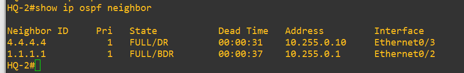
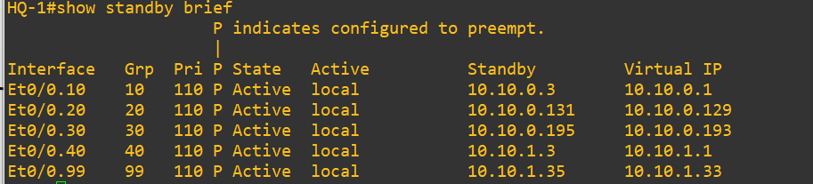
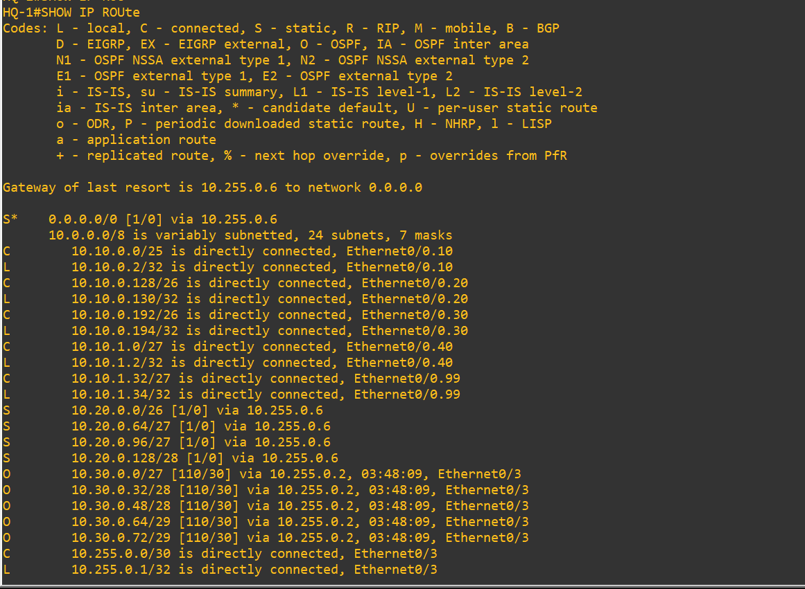
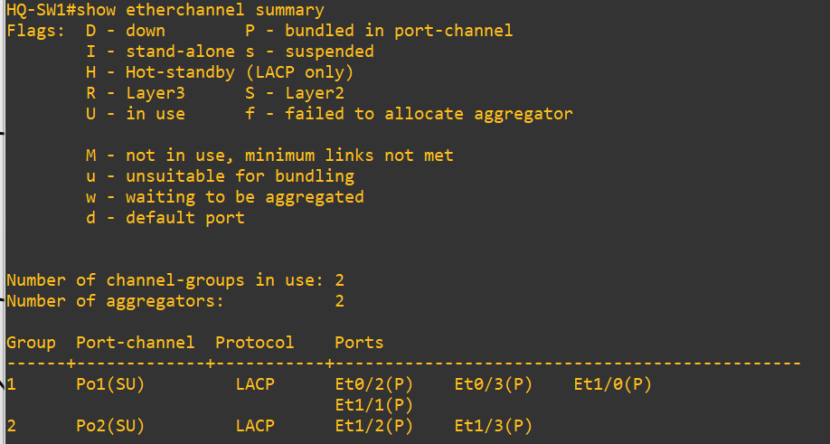
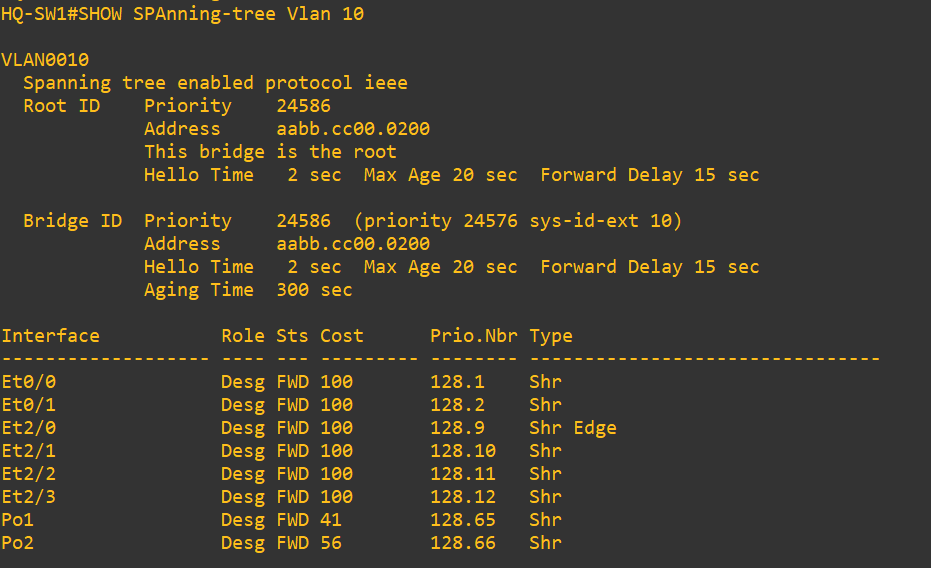
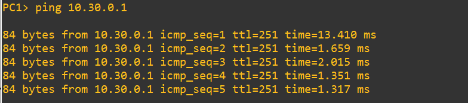

# Network Verification Evidence

This directory contains verification evidence captured from the completed GNS3 enterprise network.

The screenshots demonstrate that the routing, gateway redundancy, switching, EtherChannel, Spanning Tree, and inter-site connectivity components were operational in the final lab.

---

## 1. OSPF Neighbor Adjacency

HQ-R2 successfully formed FULL OSPF adjacencies with HQ-R1 and BRANCH-R2.

The output verifies:

- HQ-R1 Router ID: `1.1.1.1`
- BRANCH-R2 Router ID: `4.4.4.4`
- Both neighbors reached the `FULL` state
- OSPF connectivity is operational across the HQ and Branch 2 routing domain

---

## 2. HSRP Gateway Redundancy

HQ-R1 is operating as the Active HSRP router for VLANs 10, 20, 30, 40, and 99.

The output verifies:

- HSRP Version 2 operation
- HQ-R1 priority of `110`
- Preemption enabled
- HQ-R1 operating as Active
- HQ-R2 addresses visible as Standby peers
- Virtual default gateways configured for all HQ VLANs

---

## 3. Routing Table Verification

The HQ-R1 routing table demonstrates multiple routing mechanisms operating together.

The output includes:

- Connected HQ networks
- Local interface routes
- Static routes toward Branch 1
- OSPF-learned Branch 2 networks
- Static default route toward the ISP

This demonstrates integration of connected, static, default, and dynamically learned routes.

---

## 4. LACP EtherChannel Verification

HQ-SW1 has two operational Layer 2 EtherChannels using LACP.

The output verifies:

- `Po1(SU)` is operational
- Four physical interfaces are bundled into Port-channel1
- `Po2(SU)` is operational
- Two physical interfaces are bundled into Port-channel2
- LACP is being used for both channel groups
- Member interfaces show the `(P)` bundled state

---

## 5. Spanning Tree Verification

The VLAN 10 Spanning Tree output confirms that HQ-SW1 is the root bridge for VLAN 10.

The output demonstrates:

- PVST operation
- Configured bridge priority
- HQ-SW1 acting as the VLAN 10 root bridge
- Forwarding interface states
- Port-channel interfaces participating in STP
- Edge/PortFast behavior on the configured access interface

---

## 6. End-to-End Connectivity

A Branch 1 endpoint successfully pinged the Branch 2 VLAN 10 gateway at `10.30.0.1`.

Successful ICMP replies demonstrate routed connectivity between the two enterprise sites across the WAN and HQ routing infrastructure.

---

## Validation Summary

The collected evidence demonstrates successful operation of key technologies implemented in the lab:

- OSPF dynamic routing
- HSRP first-hop redundancy
- Static and dynamic routing integration
- LACP EtherChannel
- Spanning Tree
- VLAN-based enterprise design
- Multi-site WAN connectivity
- End-to-end IP reachability

These tests were performed against the completed GNS3 network after configuration and troubleshooting.
